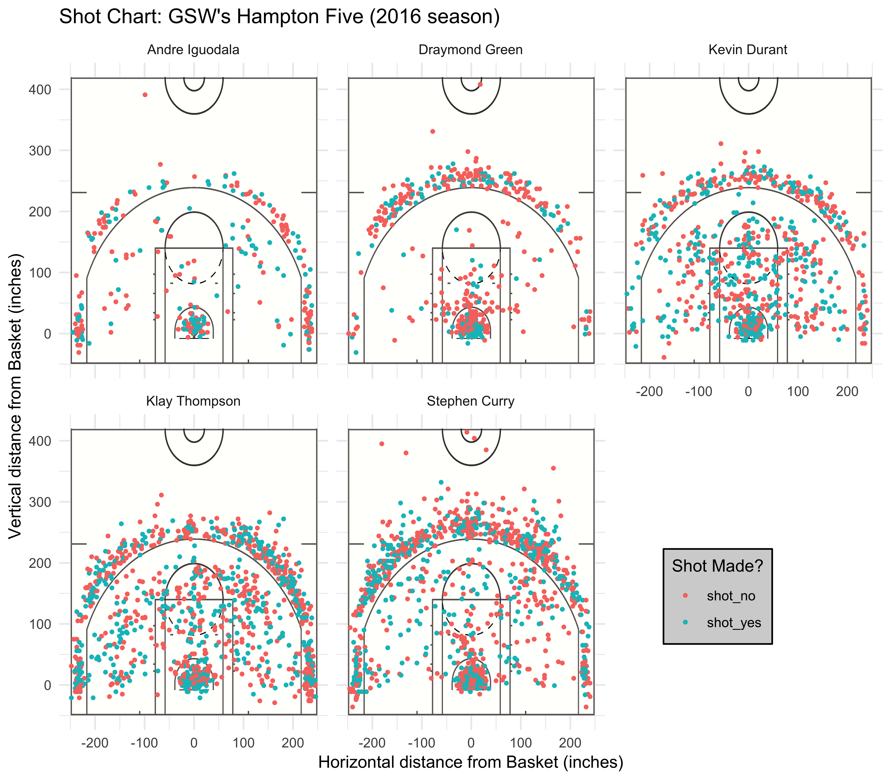

#### Motivation: The Overpowered Golden State Warriors.
The 2015-2016 Golden State Warriors (GSW) turned heads by winning a staggering _73 games out of an 82 game season_, an nba record for [most wins in a season](https://www.nba.com/history/top-moments/golden-state-warriors-win-73-games). However, they fell short of winning the championship. 

After the Warriors' collapse in the finals- blowing a 3-1 lead to the Cleveland Cavaliers, they looked to boost the roster to make come back even stronger the next year. A few weeks after the season was over, free agent Kevin Durant expressed interest in joining them. At a meeting in the Hamptons on New York's Long island, the Warriors sent four of their best players: Stephen Curry, Klay Thompson, Andre Iguodala, and Draymond Green to convince Durant to sign with the Warriors. Even though their record breaking season ended in dissapointment, the Warriors' consolation prize was [adding a former MVP and 4 time scoring champion, Kevin Durant to an already stacked roster](https://www.nba.com/history/top-moments/kevin-durant-signs-warriors-2016). Thus, the ["Hampton 5"](https://www.si.com/nba/2018/golden-state-warriors-hamptons-five-nickname-origin-history) lineup was born. 

With a stacked roster, the Warriors have positioned themselves to rise as the NBA's new dynasty for years to come, generating talks of comparison to Michael Jordan's legendary '96 Chicago Bulls, widely considered the best team of all time. So just why is this GSW team so good?

{width=750px}

####Background: Record Breaking Star Players
Led by the __Hampton 5__ lineup who closed out most games, the Warriors crushed the 2016 season. On the way to a 67-15 season, the Warriors ran over the competition, finishing with a +11.63 point differential ([the fourth highest of all time])(https://en.wikipedia.org/wiki/2016%E2%80%9317_Golden_State_Warriors_season).


Klay Thompson became the [first player to ever scored 60 points under 30 minutes](http://www.espn.com/blog/golden-state-warriors/post/_/id/2976/klay-what-thompson-dropped-60-and-it-could-have-been-more), dropping 60 points in a win against the Pacers in 29 minutes on December 5, 2016. "Chef" Steph Curry broke the [NBA record for three-pointers made in a game](https://www.nba.com/article/2016/11/08/curry-record-3-pointers
): he made 13 3-point shots against the Pelicans on November 6, 2016, cementing his bid for greatest shooter ever. Draymond Green became the first player to record [a triple-double without 10 points](https://www.sbnation.com/2017/2/10/14584492/draymond-green-triple-double-nba-history-warriors-vs-grizzlies): against the Grizzlies on Feburary 10, 2017, Green had 12 rebounds, 10 assists, 10 steals, and 5 blocks. Draymond eventually won the [Defensive Player of the Year](https://www.nba.com/history/awards/defensive-player-of-the-year) award.


The Warriors wrapped up the regular season with the best record in the league. However, the job was not complete yet. 

>"No one remembers second place," Warriors forward Draymond Green said. "No one cares who lost in the Finals. It's about winning. We're there, that's the first step, now it's about winning."

Playing with the stinging memories of losing the last year's final, the Warriors pushed on the gas and cruised through the playoffs, sweeping the Western Conference. Entering the finals undefeated at [12-0](https://www.usatoday.com/story/sports/nba/playoffs/2017/05/22/warriors-sweep-spurs-advance-nba-finals/102032554/) had never been done before. In a rematch with Lebron James and the Cavaliers, the Warriors dropped only one game in a gentleman's sweep, winning 4-1. In doing so, they set another record: a historic [16-1](https://www.google.com/search?q=16-1%20playoff%20record) playoff performance, the best post-season record the NBA has ever seen. 

Kevin Durant was named the unanimous [finals MVP](https://www.nba.com/article/2017/06/13/kevin-durant-earns-finals-mvp), averaging 35.2 points, 8.4 rebounds and 5.4 assists, while shooting 60 of 102 (.588) from the field throughout the finals. Nothing came easy for Durant:

>“I couldn’t sleep for two days,” Durant said. “I was anxious. I was jittI put in all the work and had to trust in it.”

At the end of the season, the Warriors piled up a serious award pile.
Draymond Green, Stephen Curry and Kevin Durant were voted onto the all-nba teams (the league's recognition of the 15 best players). Those three, along with Klay Thompson, were additionally voted as all stars, making it the fourth time in league history that a team had [four all-stars](https://www.nba.com/warriors/gameday/20170219/recap) on the court at the same time, leading many to joke that the Warriors were basically an all-star team by themselves.

For his role in acquiring the talent on this stacked squad, the Warriors' front office head, Bob Myers, won the [Executive of the Year Award](https://en.wikipedia.org/wiki/2016%E2%80%9317_Golden_State_Warriors_season#cite_ref-dubs_stats_9-18).

The Warriors were well on their way to creating the league's new dynasty.

{width=740px}

So how did they crush the competition? What makes GSW such a scary team?

#### Data: Details of the Hampton 5

Evidently, adding another MVP Kevin Durant to a roster consisting of the Defensive Player of the Year Draymond Green, former back to back MVP Stephen Curry, elite shooter Klay Thompson, and former finals MVP Andre Iguodala was going to create a talented team, but just how talented?

Throughout the 2016-2017 season, the "Hampton 5" posted an offensive rating of 122.4 and a defensive rating of 98.4, a net rating of [+24.0](https://www.goldenstateofmind.com/2017/11/30/16722224/2017-nba-golden-state-warriors-death-lineup-steph-curry-kevin-durant-klay-thompson-hamptons-5). They scored bucket after bucket with ease. 

```{r echo = FALSE, fig.align='center'}

```

A quick glance at this chart shows us the variety of shots each player takes. Golden State is one of the best three-point shooting teams, and its not difficult to see why: the triple threat of Durant, Thompson, and Curry on the court create a monstorous offense. The Warriors became the first team to have [four different players make four three-pointers in a game](https://en.wikipedia.org/wiki/2016%E2%80%9317_Golden_State_Warriors_season#cite_ref-dubs_stats_9-18), and the shot charts show that the lineup takes _and makes_ shots from anywhere on the court range: the blue dots cover all the different sections of a court. We see that Curry and Thompson light it up from beyond the arc, but also get plenty of mid-range jumpers and layups. Durant can score everywhere on the field. Green and Iguodala shoot signifcantly less than the other three stars, but are not bad shooters themselves.  


In the 2016 season, the Warriors had the league's highest offensive rating, led by the mighty trio of Curry, Thompson, and Durant. On the other hand, Green and Iguodala are excellent defenders that helped contribute to GSW's steallar defensive rating (2nd best in the league). In addition, Green and Iguodala can also shoot the three and make them at a decent clip. So when all 5 players are on the court, how do you guard them? 

With this offensive firepower, it is no wonder that they win a lot of games. After all, the goal in a basketball game is to score more than your opponenet. So let's take a deeper dive into the offensive stats and what makes this lineup of Curry, Thompson, Durant, Green, and Iguodala so frighteningly effective. 

#### Analysis: Efficiency of the the Hampton 5.
```{r echo=FALSE, message= FALSE, warning = FALSE}
#loading necessary packages
library(readr)
library(dplyr)

#importing data set
data_shots <- read_csv("../data/shots-data.csv")
data_shots$name <- as.factor(data_shots$name)
data_shots <- data_shots %>% group_by(name)
data_shots_2 <- data_shots %>% filter(shot_type == "2PT Field Goal")
data_shots_3 <- data_shots %>% filter(shot_type == "3PT Field Goal")
```

```{r echo=FALSE, message=FALSE}
#creating summary tables
#overall efficiency
effective_shooting <- 
  arrange(
    summarize(
     group_by(data_shots, name),
       total = n(), made = sum(shot_made_flag == "shot_yes"), perc_made = (made/total)*100),
      desc(perc_made))
#2-point shots
effective_shooting_2 <- 
  arrange(
    summarize(
     group_by(data_shots_2, name),
       total = n(), made = sum(shot_made_flag == "shot_yes"), perc_made = (made/total)*100),
      desc(perc_made))
#3-point shots
effective_shooting_3 <- 
  arrange(
    summarize(
     group_by(data_shots_3, name),
       total = n(), made = sum(shot_made_flag == "shot_yes"), perc_made = (made/total)*100),
      desc(perc_made))
```

The Warriors _as a team_ shot a riduculous 38.9% from three-point range (compared to the league average of 35.8%) and led the league at 55.7% accuracy from the two point range and 49.5% overall shooting. However, the __Hampton 5__, who posted an offensive rating of 122.4 far eclipse the league average rating of 108.8. The numbers back up this scoring: the following table details the overall field goal percentage: 

```{r echo=FALSE}
knitr::kable(effective_shooting)
```

Compared to a league average overall shooting percentage of 45.7%, four out of the five players are more accurate. A glance at these overall shooting statistics shows that Durant is extremely efficient, but Thompson and Curry shoot more. These percentages back up GSW's league leading offense. 

In a game where the goal is to score more points than your opponent, 3-point shots are more valuable than 2-point shots. The three point shot statistics is as follows:

```{r echo=FALSE}
knitr::kable(effective_shooting_3)
```

Curry and Thompson shoot and make __alot__ of three point shots, hence the nickname the "Splash Brothers." During the 2016 season, Curry was first in made three pointers, while Thompson was second in the league. This volume shooting is even more crazy considering that the pair were also in the [top 15](https://stats.nba.com/leaders/?Season=2016-17&SeasonType=Regular%20Season&PerMode=Totals&StatCategory=FG3M) in three-point shooting accuracy and far surpass the league average of 35.8%.

Golden State is feared for their sharshooting from distance, and for good reason. As legenedary Spurs coach Gregg Popovich put it: 

>“[The Spalsh Brothers are] the greatest shooting backcourt in the history of the NBA, there’s no doubt. They are the two best shooters — regardless of position — in the history of the NBA.”

If you add Kevin Durant, who is pretty good at taking 3's, to the Splash Brothers, then that truly becomes unguardable. It is no wonder opponents get buried under a flurry of scoring. The big three, Durant, Curry, and Thompson, combined for an average of 72 points every game.

{width=500px}

The Warriors stretch defenses out towards the three point line so far that other opportunities open up: mid-range jumpers, layups, and dunks become more common as opposing defenses break down. The following table represents two-point shots taken by the Hampton 5:

```{r echo=FALSE}
knitr::kable(effective_shooting_2)
```

Durant is lethal from the midrange jumper. There is a reason why he has consistently been one of the best offensive players ever since he entered the league: KD can shoot. Iguodala also has terrific accuracy shooting two pointers, perhaps helped by the fact that defenses are more worried about guarding Durant, Curry, and Thompson.

So how does the odd man out _Draymond Green_ fit? He was certianly the worst shooter out of the group and even falls below league average in shooting percentages. But that's the beauty of team composition. You can't build a car without the engine. Draymond has often been called the engine that drives the Golden State Warriors. There's two sides to a basketball game: offense and defense. Draymond brings all the litte things to the Warriors: he led the Warriors in total assists, total rebounds, total steals, and total blocks. He's the glue that holds them all together. 

#### Discussion: How the pieces fit perfectly together. 

After playing half of season with his new team, Durant noted:

>“You know, you got most of the guys that can penetrate and make plays. It’s good for scorers like Klay, Steph and myself,” Durant said. “You know Andre and Draymond do all the utilities stuff like driving to the rim, getting stops, getting rebounds, and you know they were knocking down shots when they got the opportunity to shoot ‘em. I think we play off each other well.”

This group of players has it all. Curry and Thompson can splash it in from 3-point range. Durant can score mid-range jumpers and drive to the rim. Iguodala fills in the gaps of the offense. Green carries the defense and drives the offense, dishing out assits to the other Warriors. Each player knows their role, as indicated by the shot disparity among the five:

```{r echo = FALSE}
knitr::kable(summarize(group_by(data_shots_3, name),total = n(), made = sum(shot_made_flag == "shot_yes")))
```

Why does Draymond take so many shots if he is the least accurate? Because opposing defenses know he is the weakest shooter, they often choose to leave him open and cover the other Warriors. Howeber all five are willing to shoot: take a look at the average distance from basket (in feet). 

```{r echo=FALSE}
mean_distance <- arrange(summarize(group_by(data_shots, name), distance_from_basket = mean(shot_distance)),distance_from_basket)
knitr::kable(mean_distance)
```

The Warriors don't settle for good shots: they look to create great looks. Anybody in the lineup is willing to shoot from anywhere on the court. With Thompson and Curry on the arc, Green handling the ball, and Durant and Iguodala looking to get open, this offense is really something special. 

#### Conclusion: Perhpas the best lineup of all time?

{width=700px}

Thes statistics confirm the obvious. The addition of a [4 time scoring champion](https://en.wikipedia.org/wiki/Kevin_Durant) (leader in average scoring out of all players) in Durant to one of the most accurate backcourt the "Splash Brothers" creates an unstoppable offense. It is a nightmare for opposing defenses to handle. And certainly, they crushed the competition during the regular season 

So are the 2016 Warriors the best team of all time? Coach Steve Kerr has certainly cultivated a winning culuture. 

>What we’re trying to do is embrace who we are in this moment in time. Time and space where, man, we’ve got a pretty good thing going. Let’s enjoy every day, let’s enjoy the process. You never know how long anything’s going to last.”

Fast forward to the middle of the 2018 season, and the Warriors hold onto the first seed and continue to look like favorites for the title: which would be their third in a row. 

So is the 2016 Warriors team the best of all time? Maybe not after the 2018 Warriors signed all star Demarcus Cousins to create one of the best starting five the league has ever seen. But in the 2016 season, GSW was absolutely unstoppable.

#### References:

1. [Basketball Stats](https://www.basketball-reference.com/leagues/NBA_2017.html)
2. Images:
    + https://cdn-s3.si.com/s3fs-public/styles/marquee_large_2x/public/2018/05/15/warriors-hamptons-five-lineup.jpg
    + https://cdn-s3.si.com/s3fs-public/styles/marquee_large_2x/public/2018/05/15/warriors-hamptons-five-lineup.jpg
    + https://i.pinimg.com/originals/6b/7c/39/6b7c39462154f645a8712d4fdbfd7af2.jpg
    + https://a4.espncdn.com/combiner/i?img=%2Fphoto%2F2018%2F0608%2Fr382973_1296x729_16%2D9.jpg
3. Various Sources about broken records:
    + https://www.nba.com/history/top-moments/golden-state-warriors-win-73-games
    + https://www.nba.com/history/top-moments/kevin-durant-signs-warriors-2016)
    + https://www.si.com/nba/2018/golden-state-warriors-hamptons-five-nickname-origin-history
    + https://en.wikipedia.org/wiki/2016%E2%80%9317_Golden_State_Warriors_season
    + http://www.espn.com/blog/golden-state-warriors/post/_/id/2976/klay-what-thompson-dropped-60-and-it-could-have-been-more
    + https://www.nba.com/article/2016/11/08/curry-record-3-pointers
    + https://www.sbnation.com/2017/2/10/14584492/draymond-green-triple-double-nba-history-warriors-vs-grizzlies
    + https://www.nba.com/history/awards/defensive-player-of-the-year
    + https://www.usatoday.com/story/sports/nba/playoffs/2017/05/22/warriors-sweep-spurs-advance-nba-finals/102032554/
    + https://www.google.com/search?q=16-1%20playoff%20record
    + https://www.nba.com/article/2017/06/13/kevin-durant-earns-finals-mvp
    + https://www.nba.com/warriors/gameday/20170219/recap
    + https://en.wikipedia.org/wiki/2016%E2%80%9317_Golden_State_Warriors_season#cite_ref-dubs_stats_9-18
    + https://www.goldenstateofmind.com/2017/11/30/16722224/2017-nba-golden-state-warriors-death-lineup-steph-curry-kevin-durant-klay-thompson-hamptons-5
    + https://en.wikipedia.org/wiki/2016%E2%80%9317_Golden_State_Warriors_season#cite_ref-dubs_stats_9-18
    + https://stats.nba.com/leaders/?Season=2016-17&SeasonType=Regular%20Season&PerMode=Totals&StatCategory=FG3M
    + https://en.wikipedia.org/wiki/Kevin_Durant